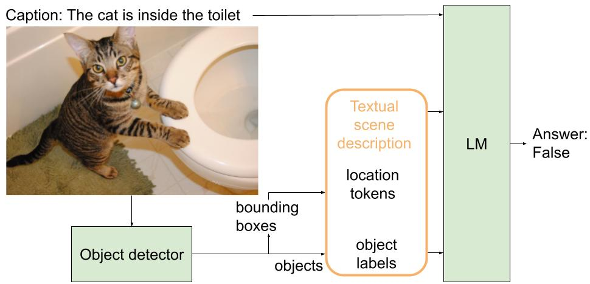

# SpatialLM: Grounding Spatial Relations in Text-Only Language Models
This is the official repository of SpatialLM, an approach to ground spatial relation in text-only Language Models. You can check all the details in the paper [TODO: add link].



## Installation
You can install all the dependencies using the `requirements.txt` file provided in the repository:

```
pip install -r requirements.txt
```
## Usage
For the spatial pretraining on COCO, you need to create a validation file (we provide ours in the repository) (TBC):
```python
python spatialpretrain.py --model bert --location_encoding token --batch_size 28 --accumulate_grad_batches 4 --precision 16 --run_name bert_spatialpt_vinvl_withlocation --max_steps 20000 --spatial_val_f
ile datasets/spatial_pretraining_valfiles/validation-vinvl-alldistractors-noattr.json
```

## Cite
If you find this repository useful, please consider citing:
```bibtex
@inproceedings{gazkune2023spatiallm,
  title={Grounding Spatial Relations in Text-Only Language Models},
  author={Azkune, Gorka and Salaberria, Ander and Agirre, Eneko},
  booktitle={TBA},
  year={2023}
}
```


